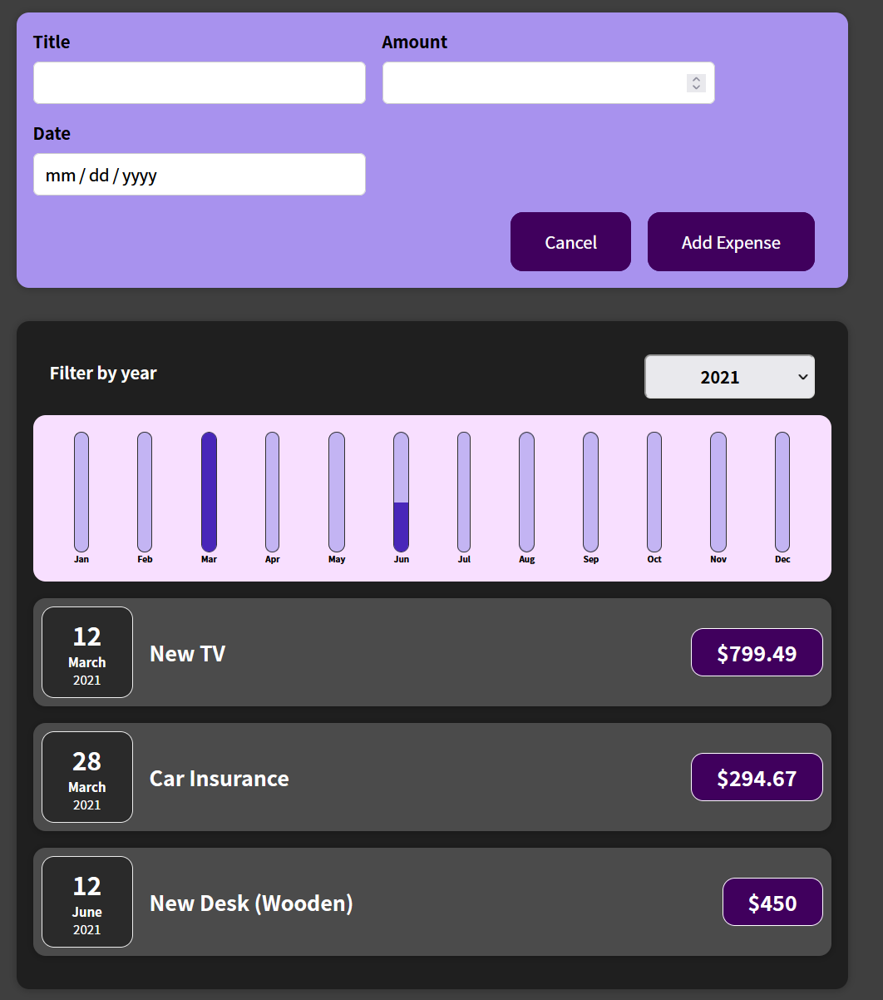

<h1>Expense_tracker</h1>

An Expense Tracker that
Filter expenses by year
and add new expense with Chart that updated.
<h2>General Information</h2>

<ul>
<li>An expense tracker Learned by  <a href="https://www.udemy.com/user/academind/">Academind by Maximilian Schwarzmüller</a></li>
</ul><ul>
<li>It's track your expenses.</li>
</ul><ul>
<li>Learn React in depth.</li>
</ul><h2>Technologies Used</h2>

<ul>
<li>CSS</li>
</ul><ul>
<li>JavaScript</li>
</ul><ul>
<li>React</li>
</ul>
<ul>
<li>Create React App</li>
</ul>
<h2>Screenshots</h2>

<h2>Setup</h2>

To run this project, install it locally using npm:
<h5>Steps</h5><ul>
<li>$ cd ../expense-tracker</li>
</ul><ul>
<li>$ npm install</li>
</ul><ul>
<li>$ npm start</li>
</ul><h2>Acknowledgement</h2>

<ul>
<li>This project was based on the tutorial:
Udemy React - The Complete Guide (incl Hooks, React Router, Redux by <a href="https://www.udemy.com/user/academind/">Academind by Maximilian Schwarzmüller</a></li>
</ul><h2>Contact</h2>

